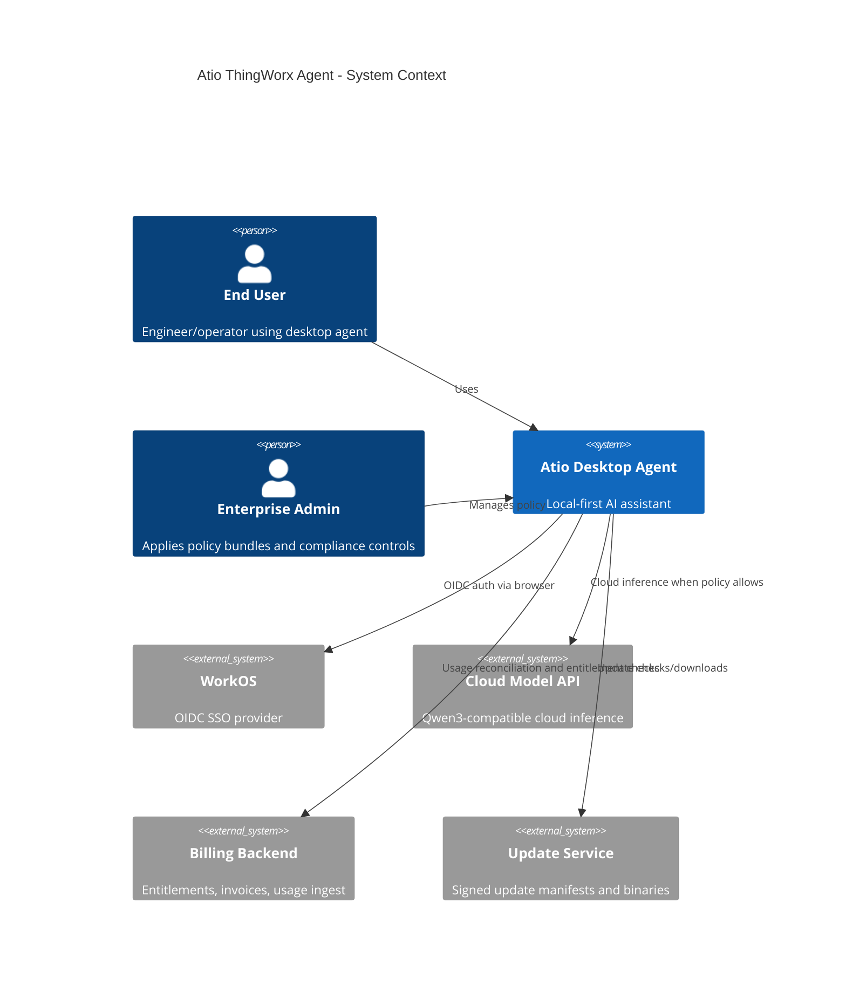
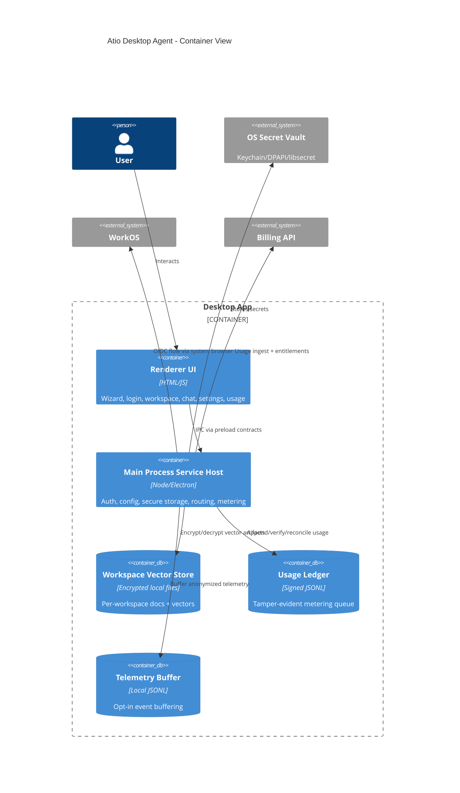
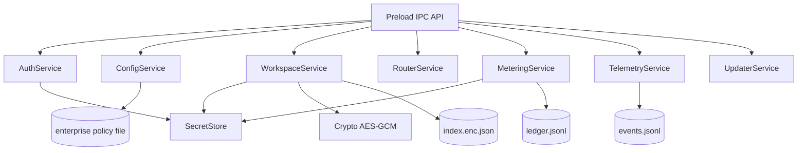
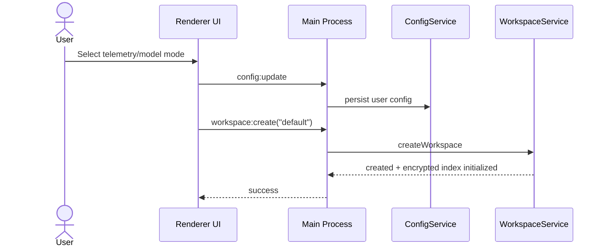
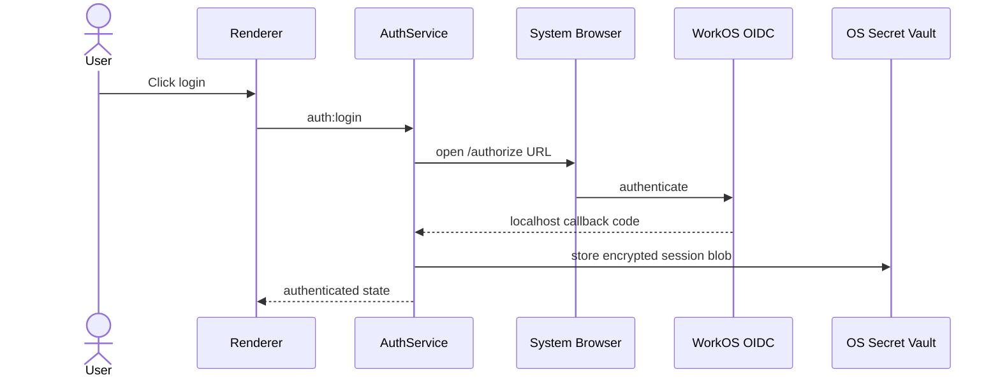
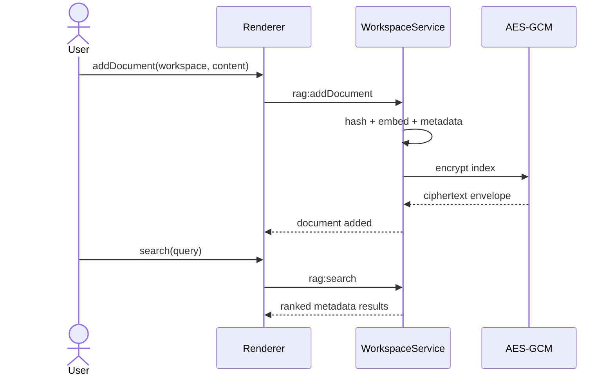
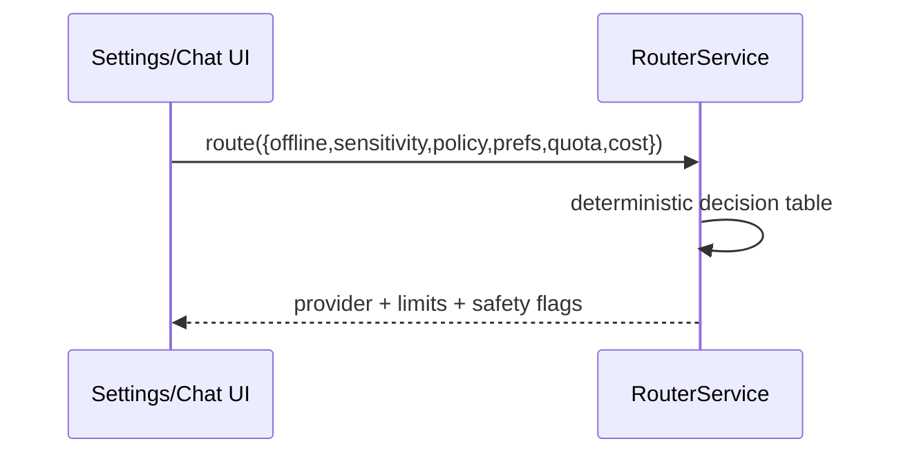
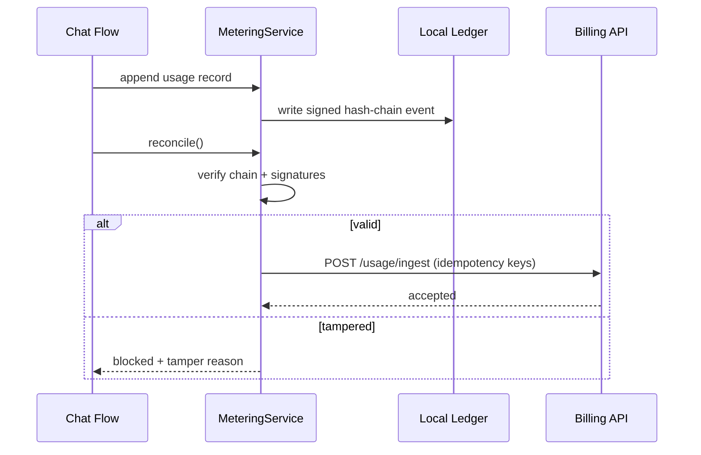

# Atio ThingWorx Agent Architecture & MVP Reference

## Table of Contents
- [1. Executive Summary](#1-executive-summary)
- [2. Assumptions](#2-assumptions)
- [3. Goals and Non-Goals](#3-goals-and-non-goals)
- [4. Success Criteria](#4-success-criteria)
- [5. C4 Diagrams](#5-c4-diagrams)
- [6. Sequence Diagrams](#6-sequence-diagrams)
- [7. Architecture Decisions (ADRs)](#7-architecture-decisions-adrs)
- [8. Security Threat Model (STRIDE)](#8-security-threat-model-stride)
- [9. Compliance Controls Mapping](#9-compliance-controls-mapping)
- [10. Operational Runbooks](#10-operational-runbooks)
- [11. Testing, Observability, and SLOs](#11-testing-observability-and-slos)
- [12. Interfaces and Schemas](#12-interfaces-and-schemas)
- [13. Open Questions and Risks](#13-open-questions-and-risks)
- [14. Glossary](#14-glossary)
- [15. Final Engineering Checklist](#15-final-engineering-checklist)

## 1. Executive Summary
Atio needs a desktop AI agent foundation that is local-first, privacy-preserving, enterprise-manageable, and billable. This architecture defines a production-aligned blueprint and ships an MVP skeleton that demonstrates the riskiest integration points: secure local data handling, WorkOS SSO flow integration, deterministic model routing, encrypted workspace vector storage, offline metering, and telemetry governance.

The selected implementation pattern is **Electron + isolated local service layer** for fast delivery, cross-platform parity, and secure process boundaries (renderer ↔ main via preload IPC). Model inference supports **local runtime and cloud fallback**, with policy controls over sensitivity, offline state, and quotas.

## 2. Assumptions
1. Connectivity is intermittent; app must provide offline-first operation.
2. Deployment is single-user desktop, optionally enterprise-managed using policy bundles/MDM-distributed configs.
3. PII is excluded by design from telemetry/metering and minimized in logs.
4. Model family target is Qwen3 coder-compatible runtimes.
5. Billing is seat subscription + PAYG overages, with enterprise invoice interfaces.
6. MVP ships stubs for cloud billing/reconciliation/update transport while implementing local controls and contracts end-to-end.

## 3. Goals and Non-Goals
### Goals
- Cross-platform desktop shell with first-run wizard, SSO, workspace management, chat/RAG hooks, settings, and usage views.
- Secure storage with OS vault and encrypted local data artifacts.
- Deterministic policy-based local/cloud model routing.
- Offline tamper-evident token metering ledger and reconciliation contract.
- Opt-in telemetry and privacy-safe observability scaffolding.

### Non-Goals
- Full production billing disputes/tax/dunning.
- Full ThingWorx feature parity.
- Model training/fine-tuning pipelines.

## 4. Success Criteria
- Fresh clone installs, runs dev app, passes lint/test/build scripts.
- Login/logout flows update authenticated state and persist secure session until expiry.
- Workspace `addDocument()`, `search()`, `deleteWorkspace()` work with encrypted local index.
- Metering tamper checks detect altered ledger.
- Telemetry cannot include raw prompt/response content.
- Crash-free sessions target ≥99.5%, update success ≥99%, and p95 RAG latency documented.

## 5. C4 Diagrams
### 5.1 Context Diagram


### 5.2 Container Diagram


### 5.3 Component Diagram (Main Process)


## 6. Sequence Diagrams
### 6.1 First Run Wizard


### 6.2 WorkOS Login


### 6.3 RAG Document Add + Search


### 6.4 Model Routing


### 6.5 Metering Reconciliation


## 7. Architecture Decisions (ADRs)
### ADR-001 Desktop framework
- Context: Need fast cross-platform desktop with web skills and security boundaries.
- Decision: Choose **Electron** with contextIsolation and preload IPC.
- Alternatives: Tauri (smaller footprint, Rust complexity), .NET MAUI (excellent native but slower web-team velocity).
- Consequences: Larger runtime size, but easiest integration for Node services/keytar and rapid iteration.

### ADR-002 Local vs cloud inference routing
- Context: Must support offline and policy-based privacy.
- Decision: Deterministic policy router where offline/high sensitivity or enterprise local-only forces local.
- Alternatives: User-only toggle; probabilistic dynamic routing.
- Consequences: Predictability and compliance auditability; may reduce optimal latency in edge cases.

### ADR-003 Vector store + encryption
- Context: Local isolated workspace retrieval required.
- Decision: Per-workspace encrypted index files (`index.enc.json`) using AES-256-GCM; metadata + vectors.
- Alternatives: SQLite+SQLCipher; embedded vector DB.
- Consequences: MVP simplicity; future scale migration path needed.

### ADR-004 Embedding strategy/versioning
- Context: Need local/cloud options and reindex policy.
- Decision: Local deterministic embedding stub v1 for MVP; schema carries `embeddingVersion`; model upgrade triggers deterministic re-embed job.
- Alternatives: Cloud-only embeddings; no version tracking.
- Consequences: Upgrade-safe, supports dedup/hash caching.

### ADR-005 Token metering architecture
- Context: Offline usage capture with tamper evidence.
- Decision: Local signed JSONL ledger, monotonic counter, prev-hash chain, reconciliation with idempotency key.
- Alternatives: Unsiged logs; online-only metering.
- Consequences: Tamper detection and offline resilience; secure key lifecycle required.

### ADR-006 Updater/signing/rollback
- Context: Enterprise-grade updates and rollback.
- Decision: Multi-channel updater abstraction (stable/beta/canary), signature verification mandatory before install, rollback slot retained.
- Alternatives: Manual updates only.
- Consequences: Requires platform-specific packaging pipeline investment.

### ADR-007 Telemetry policy
- Context: Privacy-first requirement.
- Decision: Telemetry opt-in default off; enterprise policy may force; raw prompts/responses forbidden.
- Alternatives: Opt-out default on.
- Consequences: Lower initial observability volume but higher privacy trust.

### ADR-008 Secrets and policy bundles
- Context: No plaintext secrets and enterprise controls.
- Decision: Store secrets in OS vault via keytar; merge config layers default→enterprise policy→user with policy precedence.
- Alternatives: Plain env files; custom encrypted file.
- Consequences: Better OS-native security; keyring availability dependency on Linux.

### ADR-009 Billing backend strategy
- Context: Need invoices/entitlements quickly.
- Decision: Hybrid buy+build: buy payment/invoice rails, build usage reconciliation and entitlement service.
- Alternatives: Full custom billing.
- Consequences: Faster go-live with lower regulatory overhead.

### ADR-010 OIDC flow pattern
- Context: Desktop-safe auth without renderer token leakage.
- Decision: System browser + loopback callback; session stored in secret vault; renderer reads auth state only.
- Alternatives: Embedded webview login.
- Consequences: Better phishing resistance and SSO compatibility.

## 8. Security Threat Model (STRIDE)
| Component | Threat | Example | Mitigation |
|---|---|---|---|
| Renderer IPC | Spoofing | malicious script invokes privileged IPC | contextIsolation, explicit IPC allowlist |
| Auth callback | Tampering | state/code interception | PKCE + state validation + localhost binding |
| Workspace store | Information disclosure | reading vectors/metadata | AES-GCM encrypt at rest per workspace key |
| Metering ledger | Repudiation | user edits usage file | HMAC signatures + hash chain + verification block |
| Routing policy | Elevation of privilege | bypass enterprise policy | policy precedence + immutable policy file path via MDM |
| Telemetry | Information disclosure | raw prompt exfiltration | schema allowlist + field stripping |
| Updater | Tampering | malicious update package | signed manifests/binaries + signature verification |
| Diagnostics export | Disclosure | secrets in support bundle | redaction + no secret/raw prompt fields |

## 9. Compliance Controls Mapping
### GDPR principles
- Data minimization: no raw prompts in telemetry/metering; hashed stats only.
- Purpose limitation: event taxonomy bounded to product reliability, billing, and security.
- Storage limitation: retention policies per data class.
- Integrity/confidentiality: TLS 1.3, AES-GCM at rest, signed artifacts.
- Accountability: audit logs for policy, reconciliation, and admin actions.

### SOC 2 trust criteria
- Security: secure defaults, least privilege IPC, signed updates.
- Availability: offline-first mode, retries/backoff, rollback runbook.
- Confidentiality: secret vault and encrypted local data.
- Processing integrity: idempotent ingestion and deterministic routing.
- Privacy: explicit consent, anonymization.

### ISO 27001 (high-level)
- A.5 policies: documented security/privacy policy bundle.
- A.8 asset mgmt: workspace and ledger classification.
- A.9 access control: SSO, org binding, policy enforcement.
- A.10 cryptography: AES-GCM/TLS 1.3.
- A.12 ops security: runbooks, logging, backup/restore.
- A.14 secure development: CI checks, dependency pinning, SBOM.

## 10. Operational Runbooks
### Install / uninstall
1. Verify artifact signature.
2. Install package (MSIX/pkg/AppImage/Flatpak).
3. First launch executes wizard and workspace bootstrap.
4. Uninstall removes binaries; user can choose to keep/remove local data.

### Update / rollback
1. Check channel manifest (stable/beta/canary).
2. Download delta/full package.
3. Verify signature and notarization (macOS).
4. Apply update; retain previous version slot.
5. Rollback on startup health-check failure.

### Backup / restore local data
1. Close app.
2. Backup workspace directories and ledger folder.
3. Restore to same paths; reopen app and verify ledger.

### Incident response
1. Trigger: crash surge, auth abuse, ledger tamper alerts.
2. Collect privacy-safe diagnostics bundle.
3. Rotate relevant keys and revoke sessions.
4. Publish advisory and mitigation release.

### Key rotation & policy rollout
1. Distribute new policy bundle via MDM.
2. Rotate metering signing key and workspace keys via migration command.
3. Re-verify ledger integrity and enforce session re-auth if required.

## 11. Testing, Observability, and SLOs
### Testing strategy
- Unit: crypto, routing determinism, schema validators.
- Integration: workspace CRUD + encrypted index + metering verify/reconcile.
- E2E: wizard → login → workspace → add/search → usage recording.
- Security tests: updater signature checks, prompt injection guardrails, tamper tests.
- RAG regression: golden dataset recall@k and latency budget.

### Observability plan
- OpenTelemetry-compatible traces around auth, routing, RAG, reconciliation.
- Metrics: crash-free sessions, reconcile success, update success, p95 latency.
- Logs: structured JSON with redaction pipeline.
- Crash reporting: minidumps + symbol pipeline; export sanitized diagnostics.

### SLOs
- Crash-free sessions ≥ 99.5%.
- Update success rate ≥ 99%.
- p95 RAG latency targets: local ≤ 2.5s, cloud ≤ 1.5s (excluding network anomalies).

## 12. Interfaces and Schemas
### 12.1 Plugin API (desktop-local)
```ts
interface AgentPlugin {
  id: string;
  version: string;
  permissions: Array<'read_workspace'|'call_http'|'tool_exec'>;
  onInit(ctx: PluginContext): Promise<void>;
  onChatTurn?(turn: ChatTurn): Promise<PluginResult>;
}
```

### 12.2 Local service contracts
```json
{
  "addDocumentRequest": {
    "workspace": "project-a",
    "source": "docs/spec.md",
    "content": "...",
    "sensitivity": "low"
  },
  "searchRequest": {
    "workspace": "project-a",
    "query": "what is auth flow",
    "k": 5
  }
}
```

### 12.3 Embedding service contract
```json
{
  "model": "qwen3-embed-local-v1",
  "items": [
    { "id": "chunk-1", "contentHash": "sha256:...", "text": "..." }
  ],
  "options": { "batchSize": 32, "retry": { "maxAttempts": 3, "backoffMs": 250 } }
}
```

Response:
```json
{
  "embeddingVersion": "qwen3-embed-local-v1@2026-01-15",
  "vectors": [ { "id": "chunk-1", "dims": 3072, "values": [0.1, 0.2] } ],
  "cached": ["chunk-1"]
}
```

### 12.4 Routing decision schema
```json
{
  "$id": "RoutingDecision",
  "type": "object",
  "required": ["provider", "limits", "safetyFlags"],
  "properties": {
    "provider": { "enum": ["local", "cloud"] },
    "limits": {
      "type": "object",
      "properties": {
        "maxInputTokens": { "type": "integer" },
        "maxOutputTokens": { "type": "integer" }
      },
      "required": ["maxInputTokens", "maxOutputTokens"]
    },
    "safetyFlags": {
      "type": "object",
      "properties": {
        "enforcePromptSanitization": { "type": "boolean" },
        "toolAllowlistOnly": { "type": "boolean" },
        "redactSecrets": { "type": "boolean" },
        "provenanceTracking": { "type": "boolean" }
      },
      "required": ["enforcePromptSanitization", "toolAllowlistOnly", "redactSecrets", "provenanceTracking"]
    }
  }
}
```

### 12.5 Telemetry envelope schema
```json
{
  "$id": "TelemetryEnvelope",
  "type": "object",
  "required": ["eventId", "eventName", "ts", "attrs"],
  "properties": {
    "eventId": { "type": "string" },
    "eventName": { "type": "string" },
    "ts": { "type": "string", "format": "date-time" },
    "attrs": { "type": "object", "additionalProperties": true }
  }
}
```

### 12.6 OpenAPI snippet (billing interfaces)
```yaml
openapi: 3.0.3
info:
  title: Atio Billing Interfaces
  version: 0.1.0
paths:
  /usage/ingest:
    post:
      summary: Ingest usage records (idempotent)
      requestBody:
        required: true
      responses:
        '202': { description: accepted }
  /entitlements:
    get:
      summary: Get seat/subscription status
      responses:
        '200': { description: entitlement payload }
  /invoices:
    get:
      summary: List invoices
      responses:
        '200': { description: invoices list }
  /checkout:
    post:
      summary: Create checkout session
      responses:
        '200': { description: checkout URL }
  /portal:
    post:
      summary: Create billing portal session
      responses:
        '200': { description: portal URL }
```

### 12.7 Metering usage record schema
```json
{
  "$id": "UsageRecord",
  "type": "object",
  "required": ["orgId", "tenantId", "userId", "deviceId", "workspaceId", "operation", "provider", "model", "promptTokens", "outputTokens", "latencyMs", "costUnits"],
  "properties": {
    "operation": { "enum": ["completion", "embedding", "rerank", "tool_call"] },
    "orgId": { "type": "string" },
    "tenantId": { "type": "string" },
    "userId": { "type": "string" },
    "deviceId": { "type": "string" },
    "workspaceId": { "type": "string" },
    "feature": { "type": "string" },
    "provider": { "type": "string" },
    "model": { "type": "string" },
    "promptTokens": { "type": "integer" },
    "outputTokens": { "type": "integer" },
    "latencyMs": { "type": "integer" },
    "costUnits": { "type": "number" }
  }
}
```

## 13. Open Questions and Risks
1. WorkOS token exchange endpoint contract details for desktop confidential/public client profile.
   - Mitigation: Add dedicated backend token broker for production.
2. Linux keyring variability.
   - Mitigation: startup diagnostics and enterprise packaging guidance.
3. Large local vector indexes and compaction strategy.
   - Mitigation: move to SQLite/embedded vector DB in v2 with background compactor.
4. Model output safety policies across local runtimes.
   - Mitigation: canonical pre/post guardrail middleware.
5. Billing drift from prolonged offline periods.
   - Mitigation: enforce reconciliation windows and temporary caps.

## 14. Glossary
- **Workspace**: isolated local data namespace.
- **Ledger**: append-only signed usage record store.
- **Entitlement**: subscription/seat rights for features.
- **Policy bundle**: enterprise-managed config that can override user settings.
- **RAG**: retrieval-augmented generation.
- **SSO**: single sign-on via enterprise identity provider.

## 15. Final Engineering Checklist
- [x] Wizard, login, workspace, chat, settings, usage screens implemented.
- [x] WorkOS system-browser login path with loopback callback hook.
- [x] Secrets only in OS vault API.
- [x] Config layering with enterprise policy precedence.
- [x] Encrypted workspace vector artifact and CRUD flows.
- [x] Deterministic model routing service.
- [x] Signed metering ledger with tamper detection and reconciliation stub.
- [x] Opt-in telemetry buffering with content scrubbing.
- [x] Update check/verify stub and release channel concept.
- [x] CI baseline, README, env example, scripts.
